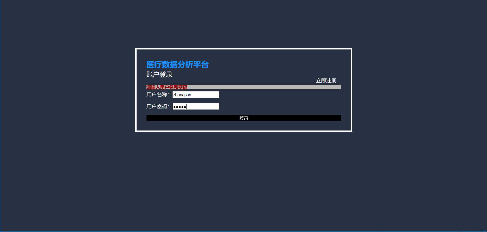

# Google
# 2020 Google Girl Hackathon_Semifinal Round_社会主义接班人
# 基于微博超话的医疗数据分析
## 项目运行指南
在本地打开项目，进入webFront文件夹，先执行npm install  
安装成功后，执行npm run start  
在浏览器中打开http://localhost:4200/  
即可访问操作  
如果操作不成功，请您可以修改webFront中的proxy.fig.json中的"target":为http://39.106.175.112:8080/GoogleHTML  

Demo
## 网站访问：
### 1.登录 

可利用已经注册的账号进行登录，跳转到首页。
### 2.注册

保证在没有账号的前提下，可以通过注册账号，登录到网站的首页查询信息，注册信息将持久化保存至云端数据库，利用成功注册账号可进行登录。
### 3.欢迎页面
 
本网站的使用指南。
## 获取数据-自定义网页

 用户输入网址信息，可筛选出网页中的患者姓名和疾病名称且在左侧显示该网页，方便浏览比对。
## 统计分析：
### 1.全国疫情地图

点击侧边栏中统计分析这一条，点击地区以及全国分，系统自动得到当前时间并显示，后台计算全国累计求助个数以及较昨日增加的求助患者个数，并自动生成全国各省份求助病例的个数显示在求助病例全国数据中，后台通过求助病例全国的数据自动生成柱状图进行显示。
### 2.各省疫情地图

点击各省分时，在疫情求助地图中生成省份的选栏，点击选择希望显示的某省信息，系统进行对该省累计求助个数、较昨日增加个数、该省所有市的求助病例数据的计算并显示在对应的页面框中，然后根据各省数据自动生成柱状图并显示。
### 3.各市疫情地图

点击各城市分时，系统得到所有省及其城市的名称显示在选栏中，选择某市，系统进行对该市累计求助个数、较昨日增加个数、该市所有地区的求助病例数据的计算并显示在对应的页面框中，然后根据各市数据自动生成柱状图并显示。
### 4.求助年龄段分布

点击最上方选栏中的年龄，系统自动计算所有年龄的累计求助病例的个数以及较昨日增加个数，并将病例年龄以如上年龄段进行分类、计算，得到求助病例年龄数据并进行显示，系统在后台根据年龄数据进行柱状图的绘制再显示在页面中。
### 5.患病时间统计
年：
 
点击最上方选栏中的时间一栏，再点击年这一栏，系统自动计算以年为单位的累计求助个数以及较昨日增加的个数，系统计算每一年的求助病例个数并显示在患病时间数据这模块中，再根据这些信息生成柱状图并显示。        
  
月：
 
点击月，系统计算2020年以来所有月份的累计求助个数以及较昨日增加个数并显示，接着系统以月为单位计算每月各自的求助病例个数且根据这些信息画出柱状图，显示在界面中。  
日：
 
点击日，系统计算2020年以来每天的累计求助个数以及较昨日增加个数并显示，接着系统以日为单位计算每月各自的求助病例个数并将这些日期由小到大排序显示，然后根据这些信息画出柱状图，显示在界面中。
## 地区预警：
 
点击侧边栏的地区预警，系统生成各地区的防控建议。然后，系统按照各省的患病个数以及高风险地区、中风险地区的判断条件得到高风险地区和中风险地区的各省名并显示在对应的页面中，点击某省时，系统根据该省的数据得到该省的年龄段分布、各市分布、2020年以来各月份分布，并根据这三项数据分别绘制地区年龄段分布饼图、地区各市分布柱状图、地区各月份分布折线图，最后显示在页面中。
## 危急患者：

将年龄在80以上的患者为危急患者，可显示出所有符合该标准的患者信息。并且根据地区相同以及年龄段在70-90之间查询数据库，得到相似病例，若无满足该情况的病例则查询城市相同以及年龄段在70-90之间的病例，之后刷新当前页面，显示相似病例。

